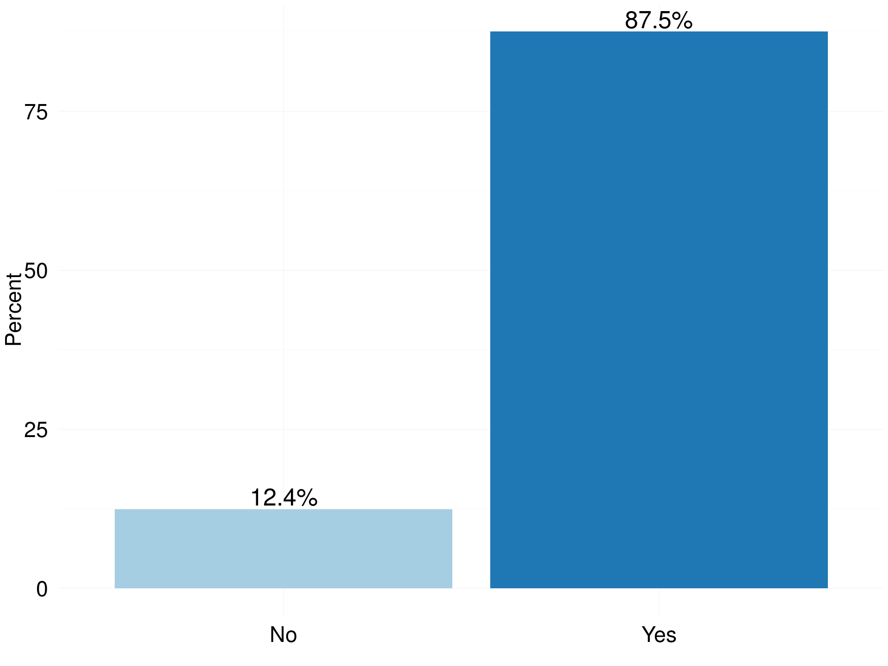

# RSE Survey 2016
Olivier PHILIPPE  
26 June 2016  


|   |Field of Education                         | Total Respondents| Percent|
|:--|:------------------------------------------|-----------------:|-------:|
|12 |Technologies                               |                 1|    0.30|
|5  |Historical and Philosophical studies       |                 2|    0.61|
|6  |Linguistics  Classics and related subjects |                 3|    0.91|
|11 |Subjects allied to Medicine                |                 3|    0.91|
|2  |Combined studies                           |                 7|    2.12|
|10 |Social studies                             |                 7|    2.12|
|8  |Other                                      |                 9|    2.73|
|1  |Biological Sciences                        |                25|    7.58|
|4  |Engineering                                |                26|    7.88|
|7  |Mathematical and Computer Sciences         |                39|   11.82|
|3  |Computer Sciences                          |                78|   23.64|
|9  |Physical Sciences                          |               130|   39.39|

<!-- -->


|   |level of Education   | Total Respondents| Percent|
|:--|:--------------------|-----------------:|-------:|
|3  |Undergraduate/Others |                41|   12.24|
|2  |Master Degree        |                61|   18.21|
|1  |Doctorate            |               233|   69.55|

<!-- -->


|Gender | Total Respondents| Percent|
|:------|-----------------:|-------:|
|Female |                31|   11.74|
|Male   |               233|   88.26|

<!-- -->


<!-- -->


|   |Type of contract                   | Total Respondents| Percent|
|:--|:----------------------------------|-----------------:|-------:|
|1  |Agency staff                       |                 1|    0.30|
|3  |Freelancer consultant  contractors |                 4|    1.19|
|2  |Fixed term                         |               156|   46.57|
|4  |Permanent                          |               174|   51.94|

<!-- -->


<!-- -->


<!-- -->


|Bus Factor | Total Respondents| Percent|
|:----------|-----------------:|-------:|
|1          |               143|   44.69|
|2          |                99|   30.94|
|3          |                36|   11.25|
|4          |                15|    4.69|
|5          |                27|    8.44|

<!-- -->


|   |Technical hand over | Total Respondents| Percent|
|:--|:-------------------|-----------------:|-------:|
|2  |Yes                 |                75|   23.29|
|1  |No                  |               247|   76.71|

<!-- -->


|Contribution to paper | Total Respondents| Percent|
|:---------------------|-----------------:|-------:|
|No                    |                38|    11.8|
|Yes                   |               284|    88.2|

<!-- -->


<!-- -->


<!-- -->


<!-- -->


<!-- -->


<!-- -->


<!-- -->

```
## 
## 	Shapiro-Wilk normality test
## 
## data:  df$TurnOver.Agg
## W = 0.9682, p-value = 5.679e-06
```
