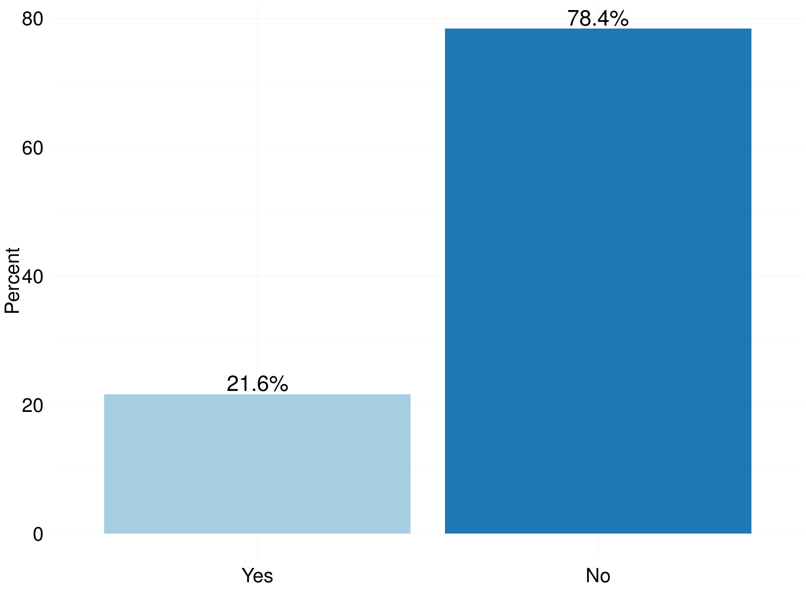

# RSE Survey 2016
Olivier PHILIPPE  
26 June 2016  

|   |Field of Education                         | Total Respondents| Percent|
|:--|:------------------------------------------|-----------------:|-------:|
|5  |Historical and Philosophical studies       |                 2|    0.50|
|12 |Technologies                               |                 2|    0.50|
|6  |Linguistics  Classics and related subjects |                 3|    0.75|
|11 |Subjects allied to Medicine                |                 3|    0.75|
|2  |Combined studies                           |                 7|    1.75|
|10 |Social studies                             |                 8|    2.00|
|8  |Other                                      |                12|    3.00|
|4  |Engineering                                |                30|    7.50|
|1  |Biological Sciences                        |                36|    9.00|
|7  |Mathematical and Computer Sciences         |                46|   11.50|
|3  |Computer Sciences                          |               101|   25.25|
|9  |Physical Sciences                          |               150|   37.50|

<!-- -->

|   |level of Education   | Total Respondents| Percent|
|:--|:--------------------|-----------------:|-------:|
|3  |Undergraduate/Others |                58|   14.11|
|2  |Master Degree        |                78|   18.98|
|1  |Doctorate            |               275|   66.91|

<!-- -->

|Gender | Total Respondents| Percent|
|:------|-----------------:|-------:|
|Female |                31|   10.69|
|Male   |               259|   89.31|

<!-- -->

<!-- -->

|   |Type of contract                   | Total Respondents| Percent|
|:--|:----------------------------------|-----------------:|-------:|
|1  |Agency staff                       |                 2|    0.54|
|3  |Freelancer consultant  contractors |                 5|    1.36|
|2  |Fixed term                         |               175|   47.68|
|4  |Permanent                          |               185|   50.41|

<!-- -->

<!-- -->

<!-- -->

|Bus Factor | Total Respondents| Percent|
|:----------|-----------------:|-------:|
|1          |               157|   44.60|
|2          |               106|   30.11|
|3          |                42|   11.93|
|4          |                18|    5.11|
|5          |                29|    8.24|

<!-- -->

|   |Technical hand over | Total Respondents| Percent|
|:--|:-------------------|-----------------:|-------:|
|2  |Yes                 |                83|   23.45|
|1  |No                  |               271|   76.55|

<!-- -->

|Contribution to paper | Total Respondents| Percent|
|:---------------------|-----------------:|-------:|
|No                    |                38|   10.73|
|Yes                   |               316|   89.27|

<!-- -->

<!-- -->

<!-- -->

<!-- -->

<!-- -->

<!-- -->

<!-- -->
