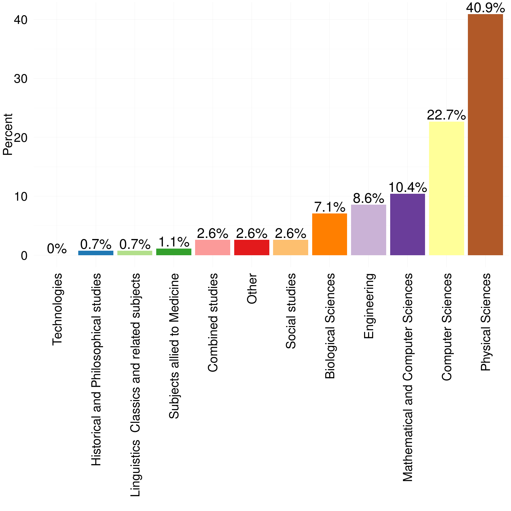
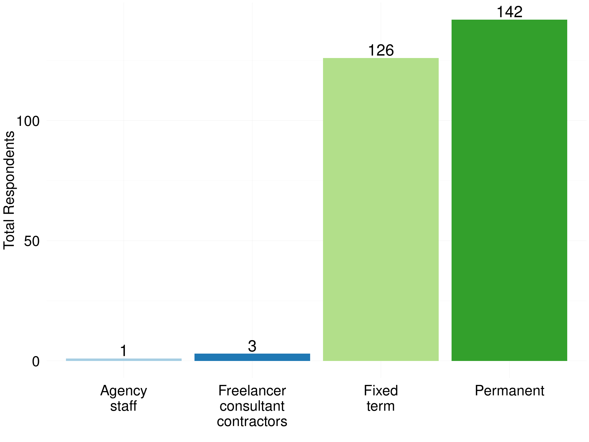
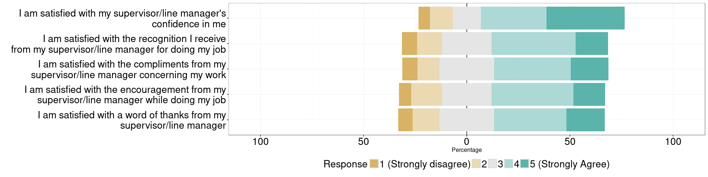
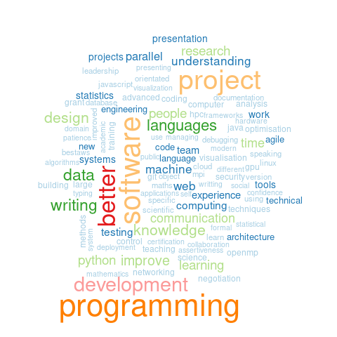

# RSE Survey 2016
Olivier PHILIPPE  
26 June 2016  

|   |Field of Education                         | Total Respondents| Percent|
|:--|:------------------------------------------|-----------------:|-------:|
|12 |Technologies                               |                 1|    0.30|
|5  |Historical and Philosophical studies       |                 2|    0.61|
|6  |Linguistics  Classics and related subjects |                 3|    0.91|
|11 |Subjects allied to Medicine                |                 3|    0.91|
|2  |Combined studies                           |                 7|    2.12|
|10 |Social studies                             |                 7|    2.12|
|8  |Other                                      |                 9|    2.73|
|1  |Biological Sciences                        |                25|    7.58|
|4  |Engineering                                |                26|    7.88|
|7  |Mathematical and Computer Sciences         |                39|   11.82|
|3  |Computer Sciences                          |                78|   23.64|
|9  |Physical Sciences                          |               130|   39.39|

<!-- -->

|   |level of Education   | Total Respondents| Percent|
|:--|:--------------------|-----------------:|-------:|
|3  |Undergraduate/Others |                41|   12.24|
|2  |Master Degree        |                61|   18.21|
|1  |Doctorate            |               233|   69.55|

<!-- -->

|Gender | Total Respondents| Percent|
|:------|-----------------:|-------:|
|Female |                31|   11.74|
|Male   |               233|   88.26|

<!-- -->

<!-- -->

|   |Type of contract                   | Total Respondents| Percent|
|:--|:----------------------------------|-----------------:|-------:|
|1  |Agency staff                       |                 1|    0.30|
|3  |Freelancer consultant  contractors |                 4|    1.19|
|2  |Fixed term                         |               156|   46.57|
|4  |Permanent                          |               174|   51.94|

<!-- -->

|First Job | Total Respondents| Percent|
|:---------|-----------------:|-------:|
|No        |               278|   82.99|
|Yes       |                57|   17.01|

<!-- -->

<!-- -->

<!-- -->

|Bus Factor | Total Respondents| Percent|
|:----------|-----------------:|-------:|
|1          |               143|   44.69|
|2          |                99|   30.94|
|3          |                36|   11.25|
|4          |                15|    4.69|
|5          |                27|    8.44|

<!-- -->

|   |Technical hand over | Total Respondents| Percent|
|:--|:-------------------|-----------------:|-------:|
|2  |Yes                 |                75|   23.29|
|1  |No                  |               247|   76.71|

<!-- -->

|Contribution to paper | Total Respondents| Percent|
|:---------------------|-----------------:|-------:|
|No                    |                38|    11.8|
|Yes                   |               284|    88.2|

<!-- -->

<!-- -->

# Work Indicators

## Introduction
How to measure the quality of a job has been debated in psychology for a long time [4]. Several models exist to understand the link between different factors of job satisfaction and turnover intention [5]–[9].
 Turnover intention is an important measure that is highly associated with the risk of employees leaving the organisation [7].
Job satisfaction is important in retaining RSEs. Perceived employability provides information on how workers values their own skills in regard of the market.
To measure the different attitudes toward the RSE role, we used scales that have been created in [5], [6], [8], [9].
These are Likert scale [10], which are 5 point ordinal scales graduated from Strongly disagree to Strongly agree.
Each scale is composed of several so called items (i.e. questions) that each measure one attitude.

### Turnover intention

|Turnover Questions                                                                                           |
|:------------------------------------------------------------------------------------------------------------|
|How often do you feel frustrated when not given the opportunity to achieve your personal work-related goals? |
|How often do you look forward to another day at work?                                                        |
|My current job satisfies my personal needs                                                                   |
|I would accept another job at the same compensation level if I was offered it                                |
|How often do you consider leaving your job?                                                                  |
|How often do dream about getting another job that will better suit your needs?                               |

<!-- -->

<!-- -->

### Perceived Employability

|Perceived Employability Questions                                                          |
|:------------------------------------------------------------------------------------------|
|It would not be very difficult for me to get an equivalent job in a different organisation |
|I can think of a number of organisations that would probably offer me a job                |
|My experience is in demand on the labour market                                            |

<!-- -->

### Satisfaction

|Satisfaction Questions                       |
|:--------------------------------------------|
|I find real enjoyment in my job              |
|Most days I am enthusiastic about my job     |
|I feel fairly well satisfied with my job     |
|I like my job better than the average person |

<!-- -->

### Recognition

|Recognition Questions                                                                          |
|:----------------------------------------------------------------------------------------------|
|I am satisfied with my supervisor/line manager's confidence in me                              |
|I am satisfied with a word of thanks from my supervisor/line manager                           |
|I am satisfied with the recognition I receive from my supervisor/line manager for doing my job |
|I am satisfied with the compliments from my supervisor/line manager concerning my work         |
|I am satisfied with the encouragement from my supervisor/line manager while doing my job       |

<!-- -->

### Feedback

|Feedback Questions                                                                    |
|:-------------------------------------------------------------------------------------|
|Do you receive sufficient information on the results of your work?                    |
|Does your work give you the opportunity to check on how well you are doing your work? |
|In your work, do you have access to sufficient data and information?                  |
|Do you receive sufficient information on the purpose of your work?                    |
|Does your work provide you with direct feedback on how well you are doing your work?  |
|Does your supervisor/line manager inform you about how well you are doing your work?  |
|Do your colleagues inform you about how well you are doing your work?                 |

<!-- -->

## Summary

<!-- -->

# Career Plan

## Introduction

<!-- -->

<!-- -->

# Wordclouds

We asked three separated questions to capture the variety of skills and tools that are important for an RSE. Each questions offered the opportunity to fills three freetext fields. These questions help us to get a gist of what is important for RSE on a more braod and less defined way. 
The following wordclouds give an idea of that aspect, without pretenting to be rigourous. 

## Most important skills for an RSE

<!-- -->

## Most important skills to improve for an RSE

<!-- -->

## Most important tool for an RSE

<!-- -->
