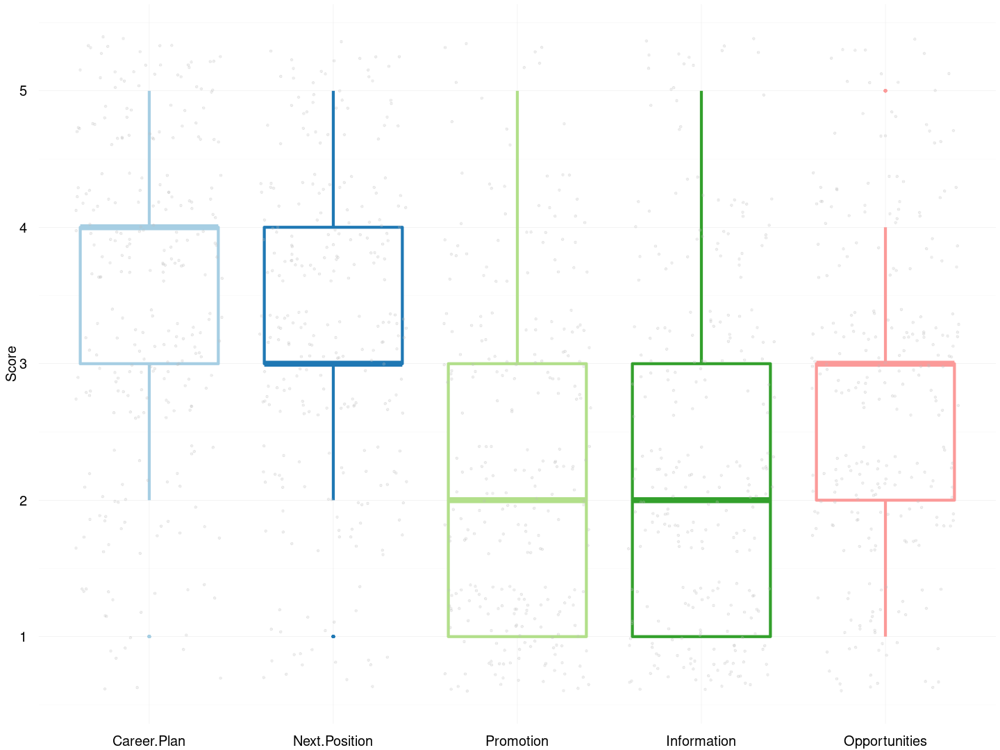
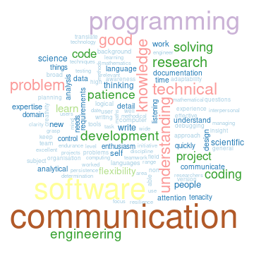
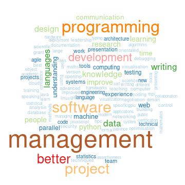

|   |Field of Education                         | Total Respondents| Percent|
|:--|:------------------------------------------|-----------------:|-------:|
|12 |Technologies                               |                 1|    0.30|
|5  |Historical and Philosophical studies       |                 2|    0.61|
|6  |Linguistics  Classics and related subjects |                 3|    0.91|
|11 |Subjects allied to Medicine                |                 3|    0.91|
|2  |Combined studies                           |                 7|    2.12|
|10 |Social studies                             |                 7|    2.12|
|8  |Other                                      |                 9|    2.73|
|1  |Biological Sciences                        |                25|    7.58|
|4  |Engineering                                |                26|    7.88|
|7  |Mathematical and Computer Sciences         |                39|   11.82|
|3  |Computer Sciences                          |                78|   23.64|
|9  |Physical Sciences                          |               130|   39.39|

|   |level of Education   | Total Respondents| Percent|
|:--|:--------------------|-----------------:|-------:|
|3  |Undergraduate/Others |                41|   12.24|
|2  |Master Degree        |                61|   18.21|
|1  |Doctorate            |               233|   69.55|

|Gender | Total Respondents| Percent|
|:------|-----------------:|-------:|
|Female |                31|   11.74|
|Male   |               233|   88.26|

|   |Type of contract                   | Total Respondents| Percent|
|:--|:----------------------------------|-----------------:|-------:|
|1  |Agency staff                       |                 1|    0.30|
|3  |Freelancer consultant  contractors |                 4|    1.19|
|2  |Fixed term                         |               156|   46.57|
|4  |Permanent                          |               174|   51.94|

|Bus Factor | Total Respondents| Percent|
|:----------|-----------------:|-------:|
|1          |               143|   44.69|
|2          |                99|   30.94|
|3          |                36|   11.25|
|4          |                15|    4.69|
|5          |                27|    8.44|

|   |Technical hand over | Total Respondents| Percent|
|:--|:-------------------|-----------------:|-------:|
|2  |Yes                 |                75|   23.29|
|1  |No                  |               247|   76.71|

|Contribution to paper | Total Respondents| Percent|
|:---------------------|-----------------:|-------:|
|No                    |                38|    11.8|
|Yes                   |               284|    88.2|

# Wordclouds

We asked three separated questions to capture the variety of skills and tools that are important for an RSE. Each questions offered the opportunity to fills three freetext fields. These questions help us to get a gist of what is important for RSE on a more braod and less defined way. 
The following wordclouds give an idea of that aspect, without pretenting to be rigourous. 

## Most important skills for an RSE

## Most important skills to improve for an RSE

## Most important tool for an RSE

