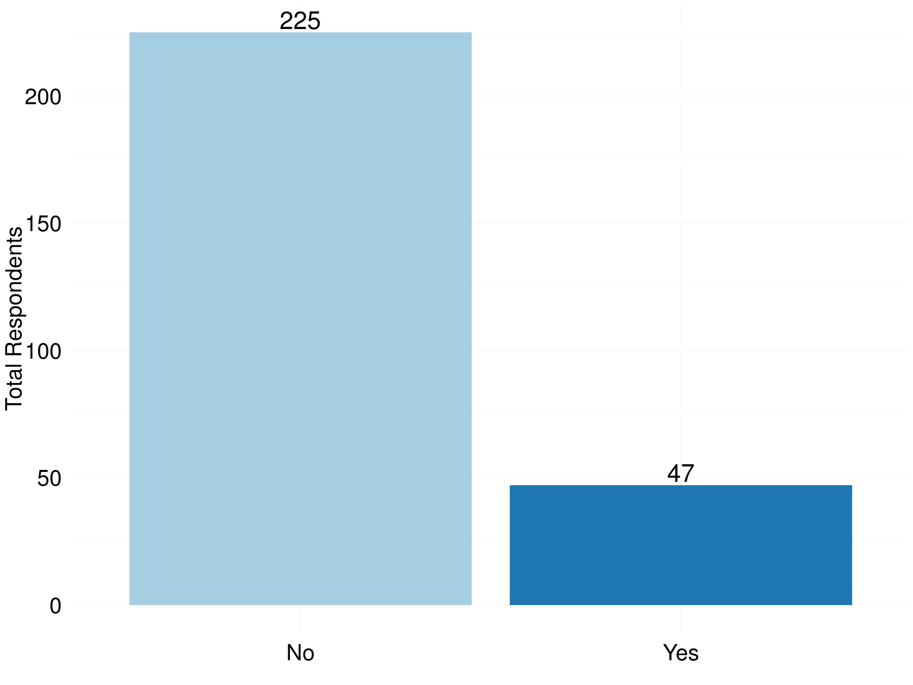
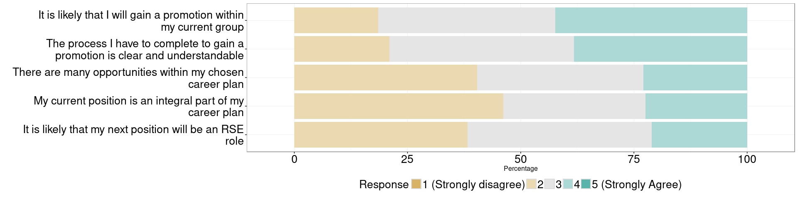

# RSE Survey 2016
Olivier PHILIPPE  
26 June 2016  

# Introduction

In a 2014 survey \cite{hettrick_its_2014}, the Software Sustainability Institute found that almost 70\% of researchers from across domains relied on software for the generation of their results, which shows the fundamental importance of software to research. 
The availability of this software and its reliability are completely dependent on the skills of the person or people who develop it. Although some academics will choose to adopt the skills they need to engineer reliable software, many will not have either the time or inclination to do so. A more scalable and sustainable approach to embedding these skills in academia is to ensure that academics have access to \emph{RSEs}.

The Software Sustainability Institute began a campaign in 2013 to increase the availability of \emph{RSEs} by ensuring they had a viable career path in academia. To provide a more accurate picture of the community’s development, it was decided to start an annual survey to collect demographics. This paper shares the results of this survey and uses these results to infer conclusions about the community. 
In March 2016, the Software Sustainability Institute  conducted a survey on the Research Software Engineers. 
The survey was composed of [TODO: find exact number of Q?] questions, asking about demography, practices and attitude toward the job and ended on the 15th of June 2016. The survey was approved by the Southampton Ethical comittee (id:18478) and respect the [TODO: Insert the different applicable laws]

## Sample and methodology
The survey was designed and stored on the Southampton online survey service: [isurvey](https://www.isurvey.soton.ac.uk/).
The research has been approved by the 
To target \emph{RSEs} directly, the survey was sent via email to the UKRSE Association’s mailing list.
Two further reminders were sent to the list to elicit responses from the community. 
People who received these emails helped to disseminate the survey via email, on blogs and using Twitter and other social media.

In total, 592 responses were received, but only [TODO: Get the write number] of these were complete (\emph{i.e. where all mandatory questions had been answered}). The survey was devised to investigate \emph{RSEs} in the UK, but dissemination of the survey had resulted in responses from around the world. This first analysis was focuses on UK, and hence on the [TODO: Find the right number] complete responses from UK-based participants.

<!-- -->

|   |Field of Education                         | Total Respondents| Percent|
|:--|:------------------------------------------|-----------------:|-------:|
|12 |Technologies                               |                 0|    0.00|
|5  |Historical and Philosophical studies       |                 2|    0.74|
|6  |Linguistics  Classics and related subjects |                 2|    0.74|
|11 |Subjects allied to Medicine                |                 3|    1.12|
|2  |Combined studies                           |                 7|    2.60|
|8  |Other                                      |                 7|    2.60|
|10 |Social studies                             |                 7|    2.60|
|1  |Biological Sciences                        |                19|    7.06|
|4  |Engineering                                |                23|    8.55|
|7  |Mathematical and Computer Sciences         |                28|   10.41|
|3  |Computer Sciences                          |                61|   22.68|
|9  |Physical Sciences                          |               110|   40.89|

<!-- -->

# Education

It had been postulated that RSEs understood both software engineering and research. To investigate their understanding of the research domain, we asked participants for the highest degree they had obtained.

A significant majority of participants (69.5%) had been awarded a PhD and a further 18.2% have achieved a Masters’ degree.

|   |level of Education   | Total Respondents| Percent|
|:--|:--------------------|-----------------:|-------:|
|3  |Undergraduate/Others |                37|   13.55|
|2  |Master Degree        |                53|   19.41|
|1  |Doctorate            |               183|   67.03|

<!-- -->

# Gender

Based on experience, it appeared that the RSE community was predominantly male. We asked participants to detail 

|   |Gender               | Total Respondents| Percent|
|:--|:--------------------|-----------------:|-------:|
|3  |Other                |                 1|    0.37|
|4  |Prefer not to answer |                 6|    2.23|
|1  |Female               |                30|   11.15|
|2  |Male                 |               232|   86.25|

<!-- -->

<!-- -->

# Contract

|   |Type of contract                   | Total Respondents| Percent|
|:--|:----------------------------------|-----------------:|-------:|
|1  |Agency staff                       |                 1|    0.37|
|3  |Freelancer consultant  contractors |                 3|    1.10|
|2  |Fixed term                         |               126|   46.32|
|4  |Permanent                          |               142|   52.21|

<!-- -->

# First job

|First Job | Total Respondents| Percent|
|:---------|-----------------:|-------:|
|No        |               225|   82.72|
|Yes       |                47|   17.28|

<!-- -->

# Salary

<!-- -->

<!-- -->

# Good practice indicators

## Bus factor

|Bus Factor | Total Respondents| Percent|
|:----------|-----------------:|-------:|
|1          |               124|   45.76|
|2          |                82|   30.26|
|3          |                32|   11.81|
|4          |                12|    4.43|
|5          |                21|    7.75|

<!-- -->

## Technical handover

|   |Technical hand over | Total Respondents| Percent|
|:--|:-------------------|-----------------:|-------:|
|2  |Yes                 |                59|   21.61|
|1  |No                  |               214|   78.39|

<!-- -->

# Academic recognition

|Contribution to paper | Total Respondents| Percent|
|:---------------------|-----------------:|-------:|
|No                    |                34|   12.45|
|Yes                   |               239|   87.55|

<!-- -->

<!-- -->

# Work Indicators

## Introduction
How to measure the quality of a job has been debated in psychology for a long time [4]. Several models exist to understand the link between different factors of job satisfaction and turnover intention [5]–[9].
 Turnover intention is an important measure that is highly associated with the risk of employees leaving the organisation [7].
Job satisfaction is important in retaining RSEs. Perceived employability provides information on how workers values their own skills in regard of the market.
To measure the different attitudes toward the RSE role, we used scales that have been created in [5], [6], [8], [9].
These are Likert scale [10], which are 5 point ordinal scales graduated from Strongly disagree to Strongly agree.
Each scale is composed of several so called items (i.e. questions) that each measure one attitude.

### Turnover intention

|Turnover Questions                                                                                           |
|:------------------------------------------------------------------------------------------------------------|
|How often do you feel frustrated when not given the opportunity to achieve your personal work-related goals? |
|How often do you look forward to another day at work?                                                        |
|My current job satisfies my personal needs                                                                   |
|I would accept another job at the same compensation level if I was offered it                                |
|How often do you consider leaving your job?                                                                  |
|How often do dream about getting another job that will better suit your needs?                               |

<!-- -->

<!-- -->

### Perceived Employability

|Perceived Employability Questions                                                          |
|:------------------------------------------------------------------------------------------|
|It would not be very difficult for me to get an equivalent job in a different organisation |
|I can think of a number of organisations that would probably offer me a job                |
|My experience is in demand on the labour market                                            |

<!-- -->

### Satisfaction

|Satisfaction Questions                       |
|:--------------------------------------------|
|I find real enjoyment in my job              |
|Most days I am enthusiastic about my job     |
|I feel fairly well satisfied with my job     |
|I like my job better than the average person |

<!-- -->

### Recognition

|Recognition Questions                                                                          |
|:----------------------------------------------------------------------------------------------|
|I am satisfied with my supervisor/line manager's confidence in me                              |
|I am satisfied with a word of thanks from my supervisor/line manager                           |
|I am satisfied with the recognition I receive from my supervisor/line manager for doing my job |
|I am satisfied with the compliments from my supervisor/line manager concerning my work         |
|I am satisfied with the encouragement from my supervisor/line manager while doing my job       |

<!-- -->

### Feedback

|Feedback Questions                                                                    |
|:-------------------------------------------------------------------------------------|
|Do you receive sufficient information on the results of your work?                    |
|Does your work give you the opportunity to check on how well you are doing your work? |
|In your work, do you have access to sufficient data and information?                  |
|Do you receive sufficient information on the purpose of your work?                    |
|Does your work provide you with direct feedback on how well you are doing your work?  |
|Does your supervisor/line manager inform you about how well you are doing your work?  |
|Do your colleagues inform you about how well you are doing your work?                 |

<!-- -->

## Summary

<!-- -->

# Career Plan

## Introduction

<!-- -->

<!-- -->

# Wordclouds

We asked three separated questions to capture the variety of skills and tools that are important for an RSE. Each questions offered the opportunity to fills three freetext fields. These questions help us to get a gist of what is important for RSE on a more braod and less defined way. 
The following wordclouds give an idea of that aspect, without pretenting to be rigourous. 

## Most important skills for an RSE

<!-- -->

## Most important skills to improve for an RSE

<!-- -->

## Most important tool for an RSE

<!-- -->
