# RSE Survey 2016
Olivier PHILIPPE  
26 June 2016  


# Socio-demographic information
## Disciplines


|   |Field of Education                         | Total Respondents| Percent|
|:--|:------------------------------------------|-----------------:|-------:|
|5  |Historical and Philosophical studies       |                 2|    0.50|
|12 |Technologies                               |                 2|    0.50|
|6  |Linguistics  Classics and related subjects |                 3|    0.75|
|11 |Subjects allied to Medicine                |                 3|    0.75|
|2  |Combined studies                           |                 7|    1.75|
|10 |Social studies                             |                 8|    2.00|
|8  |Other                                      |                12|    3.00|
|4  |Engineering                                |                30|    7.50|
|1  |Biological Sciences                        |                36|    9.00|
|7  |Mathematical and Computer Sciences         |                46|   11.50|
|3  |Computer Sciences                          |               101|   25.25|
|9  |Physical Sciences                          |               150|   37.50|

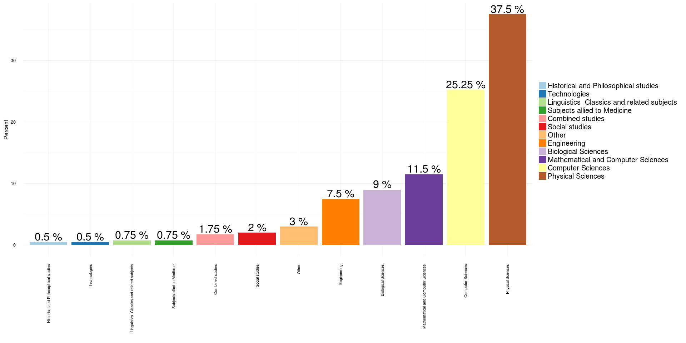<!-- -->

## Level of education


|   |level of Education   | Total Respondents| Percent|
|:--|:--------------------|-----------------:|-------:|
|3  |Undergraduate/Others |                58|   14.11|
|2  |Master Degree        |                78|   18.98|
|1  |Doctorate            |               275|   66.91|

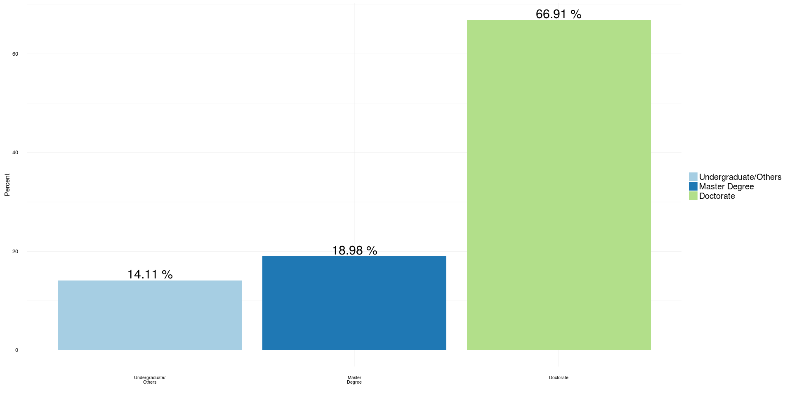<!-- -->

## Gender


```
## Using Gender, Discipline as id variables
```

```
##   Gender Discipline          variable value
## 1   <NA>       <NA> Total Respondents    NA
## 2   <NA>       <NA> Total Respondents    NA
## 3   <NA>       <NA> Total Respondents    NA
## 4   <NA>       <NA>           Percent    NA
## 5   <NA>       <NA>           Percent    NA
## 6   <NA>       <NA>           Percent    NA
```

```
##                                                  Discipline Female Male
## 1                                     101 Clinical medicine     53   47
## 2                                    102 Clinical dentistry     44   56
## 3                   103 Nursing & allied health professions     75   25
## 4                     104 Psychology & behavioural sciences     60   40
## 5                            105 Health & community studies     66   34
## 6                                  106 Anatomy & physiology     49   51
## 7                               107 Pharmacy & pharmacology     49   51
## 8                      108 Sports science & leisure studies     37   63
## 9                                    109 Veterinary science     56   44
## 10                 110 Agriculture, forestry & food science     47   53
## 11               111 Earth, marine & environmental sciences     34   66
## 12                                          112 Biosciences     44   56
## 13                                            113 Chemistry     27   73
## 14                                              114 Physics     19   81
## 15                                  115 General engineering     21   79
## 16                                 116 Chemical engineering     27   73
## 17          117 Mineral, metallurgy & materials engineering     26   74
## 18                                    118 Civil engineering     22   78
## 19        119 Electrical, electronic & computer engineering     14   86
## 20            120 Mechanical, aero & production engineering     16   84
## 21 121 IT, systems sciences & computer software engineering     22   78
## 22                                          122 Mathematics     23   77
## 23           123 Architecture, built environment & planning     33   67
## 24                    124 Geography & environmental studies     40   60
## 25                                         125 Area studies     48   52
## 26                                          126 Archaeology     43   57
## 27                   127 Anthropology & development studies     50   50
## 28                     128 Politics & international studies     36   64
## 29                             129 Economics & econometrics     29   71
## 30                                                  130 Law     50   50
## 31                          131 Social work & social policy     64   36
## 32                                            132 Sociology     54   46
## 33                        133 Business & management studies     42   58
## 34                    134 Catering & hospitality management     52   48
## 35                                            135 Education     66   34
## 36                                 136 Continuing education     62   38
## 37                                     137 Modern languages     65   35
## 38                        138 English language & literature     55   45
## 39                                              139 History     39   61
## 40                                             140 Classics     47   53
## 41                                           141 Philosophy     26   74
## 42                         142 Theology & religious studies     34   66
## 43                                         143 Art & design     49   51
## 44                144 Music, dance, drama & performing arts     43   57
## 45                                        145 Media studies     41   59
```

```
##                                                  Discipline variable value
## 1                                     101 Clinical medicine   Female    53
## 2                                    102 Clinical dentistry   Female    44
## 3                   103 Nursing & allied health professions   Female    75
## 4                     104 Psychology & behavioural sciences   Female    60
## 5                            105 Health & community studies   Female    66
## 6                                  106 Anatomy & physiology   Female    49
## 7                               107 Pharmacy & pharmacology   Female    49
## 8                      108 Sports science & leisure studies   Female    37
## 9                                    109 Veterinary science   Female    56
## 10                 110 Agriculture, forestry & food science   Female    47
## 11               111 Earth, marine & environmental sciences   Female    34
## 12                                          112 Biosciences   Female    44
## 13                                            113 Chemistry   Female    27
## 14                                              114 Physics   Female    19
## 15                                  115 General engineering   Female    21
## 16                                 116 Chemical engineering   Female    27
## 17          117 Mineral, metallurgy & materials engineering   Female    26
## 18                                    118 Civil engineering   Female    22
## 19        119 Electrical, electronic & computer engineering   Female    14
## 20            120 Mechanical, aero & production engineering   Female    16
## 21 121 IT, systems sciences & computer software engineering   Female    22
## 22                                          122 Mathematics   Female    23
## 23           123 Architecture, built environment & planning   Female    33
## 24                    124 Geography & environmental studies   Female    40
## 25                                         125 Area studies   Female    48
## 26                                          126 Archaeology   Female    43
## 27                   127 Anthropology & development studies   Female    50
## 28                     128 Politics & international studies   Female    36
## 29                             129 Economics & econometrics   Female    29
## 30                                                  130 Law   Female    50
## 31                          131 Social work & social policy   Female    64
## 32                                            132 Sociology   Female    54
## 33                        133 Business & management studies   Female    42
## 34                    134 Catering & hospitality management   Female    52
## 35                                            135 Education   Female    66
## 36                                 136 Continuing education   Female    62
## 37                                     137 Modern languages   Female    65
## 38                        138 English language & literature   Female    55
## 39                                              139 History   Female    39
## 40                                             140 Classics   Female    47
## 41                                           141 Philosophy   Female    26
## 42                         142 Theology & religious studies   Female    34
## 43                                         143 Art & design   Female    49
## 44                144 Music, dance, drama & performing arts   Female    43
## 45                                        145 Media studies   Female    41
## 46                                                      RSE   Female    12
## 47                                    101 Clinical medicine     Male    47
## 48                                   102 Clinical dentistry     Male    56
## 49                  103 Nursing & allied health professions     Male    25
## 50                    104 Psychology & behavioural sciences     Male    40
## 51                           105 Health & community studies     Male    34
## 52                                 106 Anatomy & physiology     Male    51
## 53                              107 Pharmacy & pharmacology     Male    51
## 54                     108 Sports science & leisure studies     Male    63
## 55                                   109 Veterinary science     Male    44
## 56                 110 Agriculture, forestry & food science     Male    53
## 57               111 Earth, marine & environmental sciences     Male    66
## 58                                          112 Biosciences     Male    56
## 59                                            113 Chemistry     Male    73
## 60                                              114 Physics     Male    81
## 61                                  115 General engineering     Male    79
## 62                                 116 Chemical engineering     Male    73
## 63          117 Mineral, metallurgy & materials engineering     Male    74
## 64                                    118 Civil engineering     Male    78
## 65        119 Electrical, electronic & computer engineering     Male    86
## 66            120 Mechanical, aero & production engineering     Male    84
## 67 121 IT, systems sciences & computer software engineering     Male    78
## 68                                          122 Mathematics     Male    77
## 69           123 Architecture, built environment & planning     Male    67
## 70                    124 Geography & environmental studies     Male    60
## 71                                         125 Area studies     Male    52
## 72                                          126 Archaeology     Male    57
## 73                   127 Anthropology & development studies     Male    50
## 74                     128 Politics & international studies     Male    64
## 75                             129 Economics & econometrics     Male    71
## 76                                                  130 Law     Male    50
## 77                          131 Social work & social policy     Male    36
## 78                                            132 Sociology     Male    46
## 79                        133 Business & management studies     Male    58
## 80                    134 Catering & hospitality management     Male    48
## 81                                            135 Education     Male    34
## 82                                 136 Continuing education     Male    38
## 83                                     137 Modern languages     Male    35
## 84                        138 English language & literature     Male    45
## 85                                              139 History     Male    61
## 86                                             140 Classics     Male    53
## 87                                           141 Philosophy     Male    74
## 88                         142 Theology & religious studies     Male    66
## 89                                         143 Art & design     Male    51
## 90                144 Music, dance, drama & performing arts     Male    57
## 91                                        145 Media studies     Male    59
## 92                                                      RSE     Male    88
```


|Gender |Discipline |variable          | value|
|:------|:----------|:-----------------|-----:|
|NA     |NA         |Total Respondents |    NA|
|NA     |NA         |Total Respondents |    NA|
|NA     |NA         |Total Respondents |    NA|
|NA     |NA         |Percent           |    NA|
|NA     |NA         |Percent           |    NA|
|NA     |NA         |Percent           |    NA|

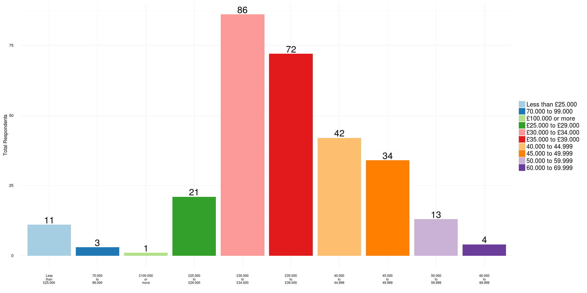<!-- -->

## Type of contract


|   |Type of contract                   | Total Respondents| Percent|
|:--|:----------------------------------|-----------------:|-------:|
|1  |Agency staff                       |                 2|    0.54|
|3  |Freelancer consultant  contractors |                 5|    1.36|
|2  |Fixed term                         |               175|   47.68|
|4  |Permanent                          |               185|   50.41|

<!-- -->


## Salary


|Salary             | Total Respondents| Percent|
|:------------------|-----------------:|-------:|
|£100.000 or more   |                 1|    0.35|
|£25.000 to £29.000 |                21|    7.32|
|£30.000 to £34.000 |                86|   29.97|
|£35.000 to £39.000 |                72|   25.09|
|40.000 to 44.999   |                42|   14.63|
|45.000 to 49.999   |                34|   11.85|
|50.000 to 59.999   |                13|    4.53|
|60.000 to 69.999   |                 4|    1.39|
|70.000 to 99.000   |                 3|    1.05|
|Less than £25.000  |                11|    3.83|

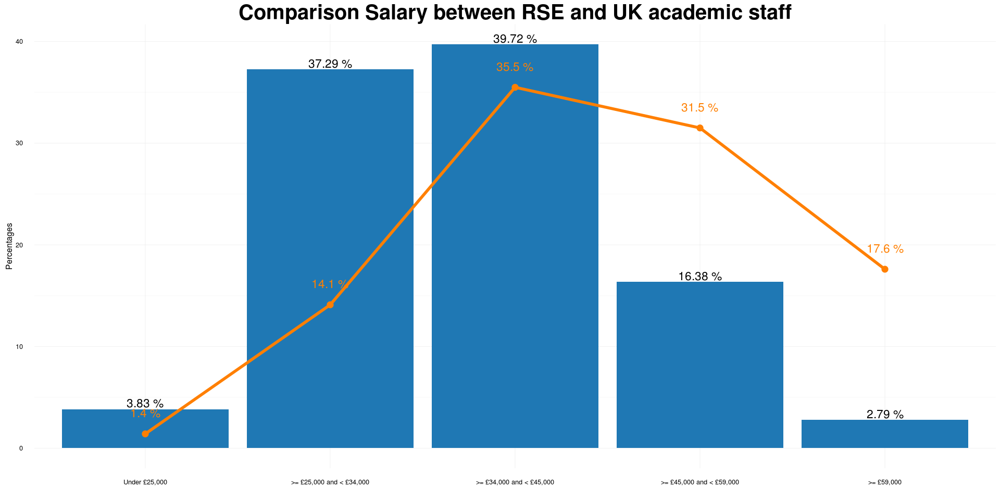<!-- -->

### Comparison with the salary for academic staff in UK


#### Data with line only (best to see the difference)

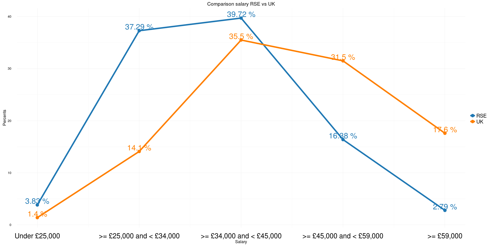<!-- -->

#### Same data but with a mix of line and barplots

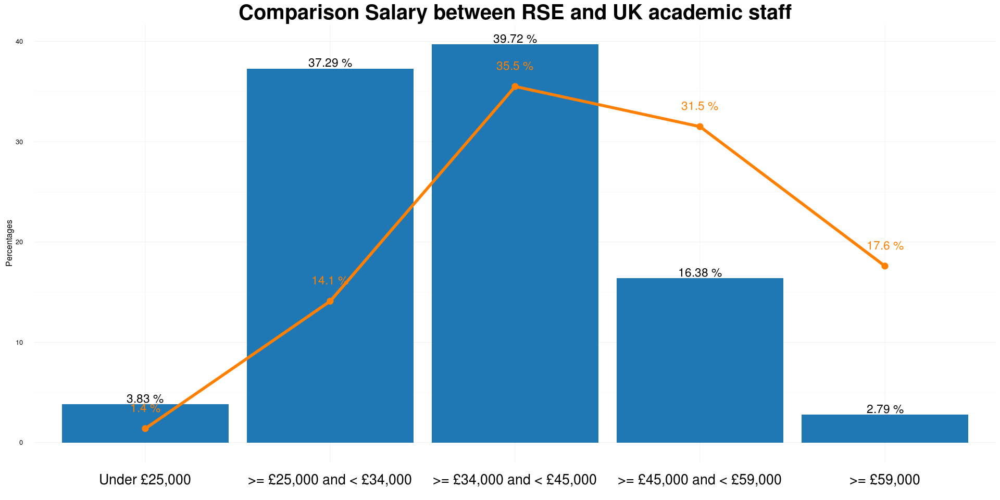<!-- -->


#### Same data but with bar plot only

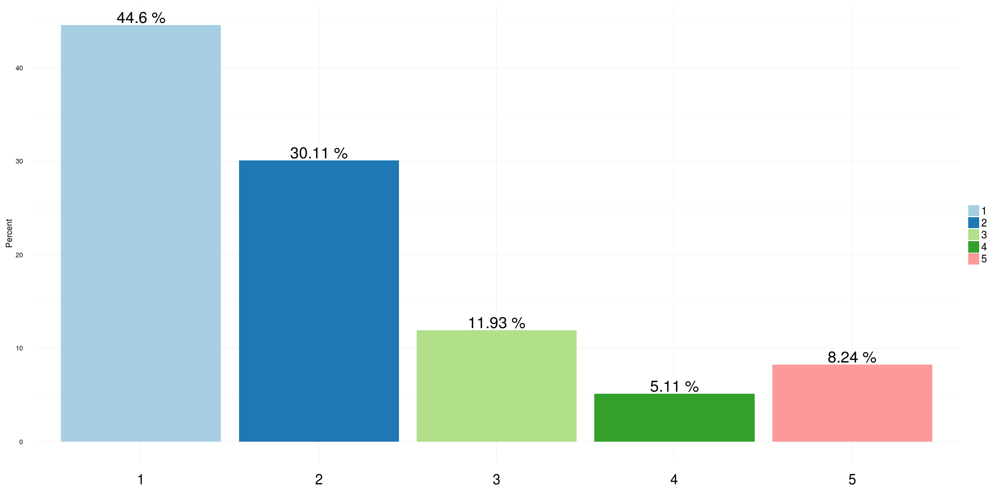<!-- -->


# Good practices

## Bus Factor


|Bus Factor | Total Respondents| Percent|
|:----------|-----------------:|-------:|
|1          |               157|   44.60|
|2          |               106|   30.11|
|3          |                42|   11.93|
|4          |                18|    5.11|
|5          |                29|    8.24|

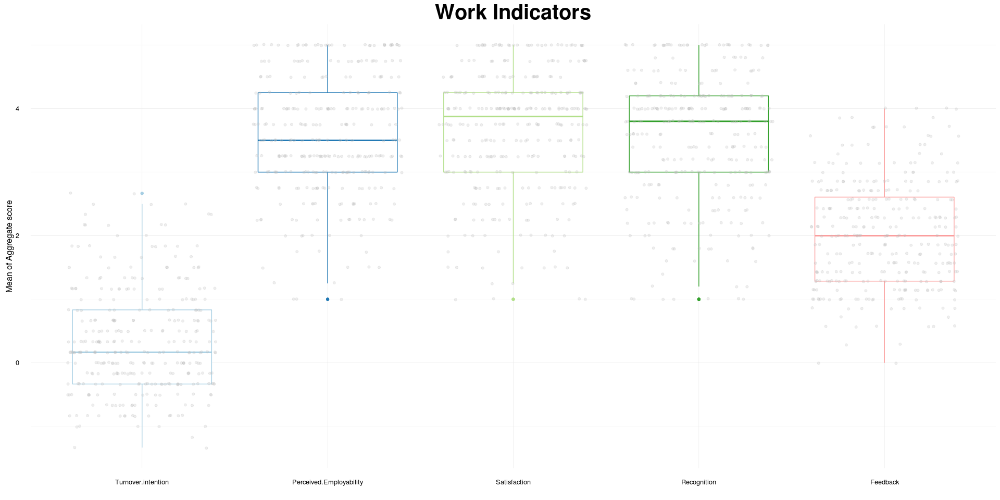<!-- -->

## Technical hand over


|   |Technical hand over | Total Respondents| Percent|
|:--|:-------------------|-----------------:|-------:|
|2  |Yes                 |                83|   23.45|
|1  |No                  |               271|   76.55|

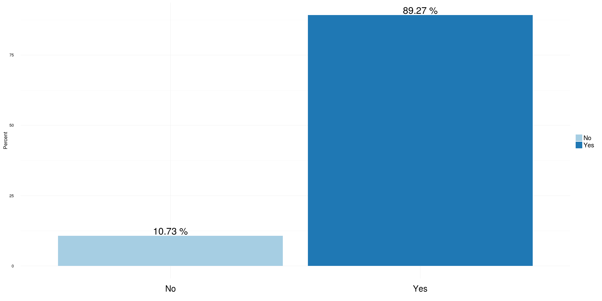<!-- -->


## Contribution papers


|Contribution to paper | Total Respondents| Percent|
|:---------------------|-----------------:|-------:|
|No                    |                38|   10.73|
|Yes                   |               316|   89.27|

<!-- -->


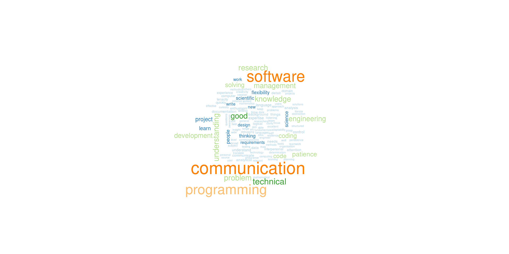<!-- -->

## Work Indicators


```
## No id variables; using all as measure variables
```


```
## Warning: Removed 1380 rows containing non-finite values (stat_boxplot).
```

```
## Warning: Removed 1380 rows containing missing values (geom_point).
```

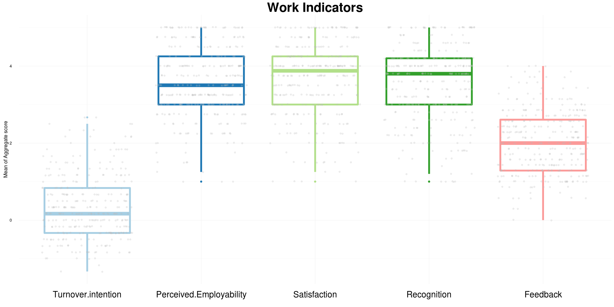<!-- -->

## Career path


<!-- -->


# Word cloud

## Important skills


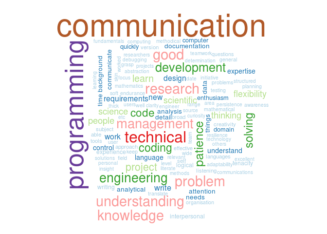<!-- -->


### Skills to improve


 
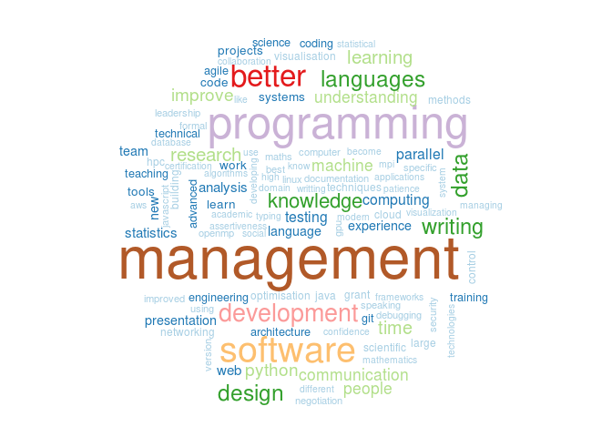<!-- -->

### Tools used


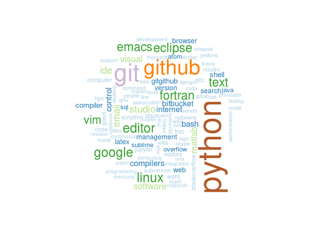<!-- -->
