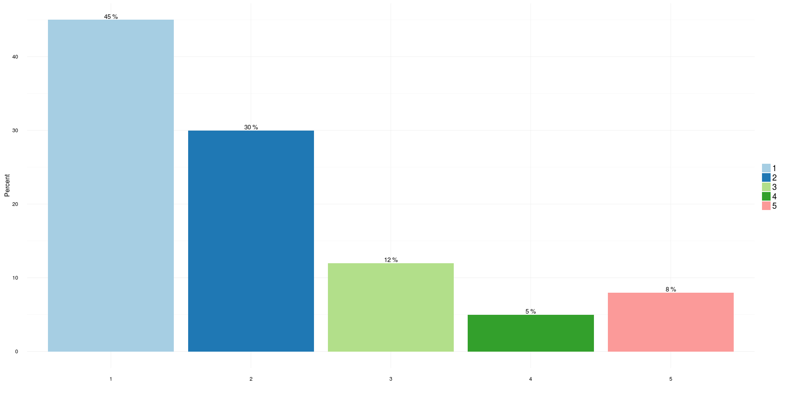

# RSE Survey 2016
Olivier PHILIPPE  
26 June 2016  

# ```{r package_options, include=FALSE}
    <!-- # Specfy the output format -->
    <!-- options(knitr.table.format = 'markdown') -->
<!-- ``` -->


```
## Loading required package: NLP
```

```
## 
## Attaching package: 'NLP'
```

```
## The following object is masked from 'package:ggplot2':
## 
##     annotate
```

```
## Loading required package: RColorBrewer
```


# Socio-demographic information
## Disciplines


|   |Field of Education                         | Total Respondents| Percent|
|:--|:------------------------------------------|-----------------:|-------:|
|5  |Historical and Philosophical studies       |                 2|       0|
|12 |Technologies                               |                 2|       0|
|6  |Linguistics  Classics and related subjects |                 3|       1|
|11 |Subjects allied to Medicine                |                 3|       1|
|2  |Combined studies                           |                 7|       2|
|10 |Social studies                             |                 8|       2|
|8  |Other                                      |                12|       3|
|4  |Engineering                                |                30|       8|
|1  |Biological Sciences                        |                36|       9|
|7  |Mathematical and Computer Sciences         |                46|      12|
|3  |Computer Sciences                          |               101|      25|
|9  |Physical Sciences                          |               150|      38|

<!-- -->

## Level of education


|   |level of Education   | Total Respondents| Percent|
|:--|:--------------------|-----------------:|-------:|
|3  |Undergraduate/Others |                58|      14|
|2  |Master Degree        |                78|      19|
|1  |Doctorate            |               275|      67|

<!-- -->

## Salary


|Salary             | Total Respondents| Percent|
|:------------------|-----------------:|-------:|
|Less than £25.000  |                11|       4|
|70.000 to 99.000   |                 3|       1|
|£100.000 or more   |                 1|       0|
|£25.000 to £29.000 |                21|       7|
|£30.000 to £34.000 |                86|      30|
|£35.000 to £39.000 |                72|      25|
|40.000 to 44.999   |                42|      15|
|45.000 to 49.999   |                34|      12|
|50.000 to 59.999   |                13|       5|
|60.000 to 69.999   |                 4|       1|

<!-- -->

## Gender


|Gender | Total Respondents| Percent|Discipline |
|:------|-----------------:|-------:|:----------|
|Female |                31|      11|RSE        |
|Male   |               259|      89|RSE        |

<!-- -->
# Good practices

## Bus Factor


|Bus Factor | Total Respondents| Percent|
|:----------|-----------------:|-------:|
|1          |               157|      45|
|2          |               106|      30|
|3          |                42|      12|
|4          |                18|       5|
|5          |                29|       8|

<!-- -->

## Technical hand over


|   |Technical hand over | Total Respondents| Percent|
|:--|:-------------------|-----------------:|-------:|
|2  |Yes                 |                83|      23|
|1  |No                  |               271|      77|

<!-- -->


## Contribution papers


|Contribution to paper | Total Respondents| Percent|
|:---------------------|-----------------:|-------:|
|No                    |                38|      11|
|Yes                   |               316|      89|

<!-- -->

<!-- ## Work in University: find the number of universities that replied (from the original list) -->

# ```{r echo=FALSE}
    # Load the different universities used
    <!-- list_universities <- read.csv('informations/list_universities.csv', header = FALSE) -->
    <!-- list_ucl <- read.csv('informations/list_ucl.csv', header = FALSE) -->
    <!-- fullUni <-  data.frame(c(as.character(list_ucl$V1), as.character(list_universities$V1))) -->
    <!-- fullUni$In.Data <- fullUni$c.as.character.list_ucl.V1...as.character.list_universities.V1.. %in% levels(df$Job.uni.CLEAN) -->
<!-- ``` -->

# ```{r}
    <!-- kable(fullUni$In.Data, digits=2, format='markdown') -->
<!-- ``` -->

## Indicators


```
## No id variables; using all as measure variables
```


```
## Warning: Removed 1380 rows containing non-finite values (stat_boxplot).
```

```
## Warning: Removed 1380 rows containing missing values (geom_point).
```

<!-- -->

# Word cloud


<!-- -->

```
## NULL
```


### Skills to improve


 
<!-- -->

```
## NULL
```

### Tools used


<!-- -->

```
## NULL
```
